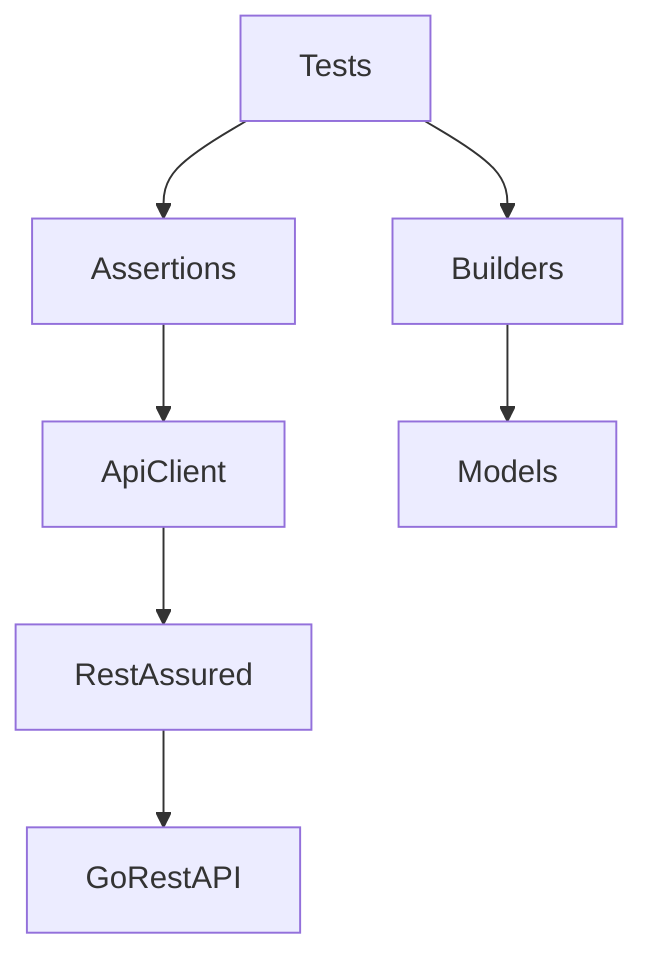
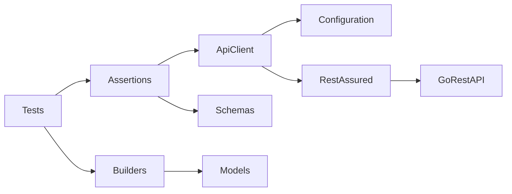
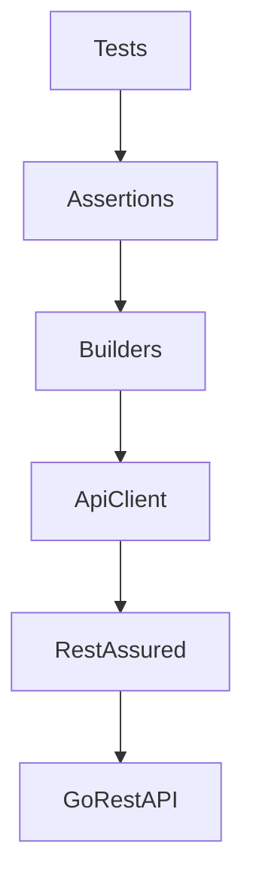

# Architecture

## Purpose

This document defines the architectural design of the API Automation Framework.
It establishes the framework structure, component responsibilities, dependency
rules, and engineering principles that guide its implementation, maintenance,
and future evolution.

## Scope

This document applies to the entire API Automation Framework, including its
internal components, project organization, dependency model, and architectural
decisions.

## Overview

The framework follows a layered architecture designed around the principles of
separation of concerns, modularity, and maintainability. Each layer has a single
responsibility and communicates only with the layer immediately below it,
minimizing coupling and maximizing extensibility.

## Architectural Goals

The architecture is designed to achieve the following goals:

- Maintainability
- Scalability
- Reusability
- Readability
- Test reliability
- Low coupling
- Separation of concerns
- Ease of extension

Every architectural decision should contribute to one or more of these goals.

## High-Level Architecture

The following diagram illustrates the logical architecture of the framework.

## Layer Responsibilities

| Layer         | Responsibility                                            | Depends On           |
|---------------|-----------------------------------------------------------|----------------------|
| Tests         | Express business intent without implementation details.   | Assertions, Builders |
| Assertions    | Encapsulate reusable validations and business assertions. | API Client           |
| Builders      | Generate reusable test data.                              | Models               |
| API Client    | Encapsulate all HTTP communication.                       | REST Assured         |
| Models        | Represent request and response objects.                   | None                 |
| Configuration | Manage environment configuration and authentication.      | None                 |
| REST Assured  | Execute HTTP requests to the API.                         | None                 |

## Logical Components

The framework is organized into logical components rather than
implementation-specific packages. The physical project structure may evolve
without changing these responsibilities.

## Design Principles

The framework follows these engineering principles:

- Tests express business intent rather than implementation details.
- HTTP communication is encapsulated behind reusable API clients.
- Request and response models are separated.
- Test data is generated through Builders.
- Environment configuration is externalized.
- Reusable assertions eliminate duplicated validation logic.
- JSON Schema validation governs API contract verification.
- Tests are deterministic and independent.
- Every class has a single responsibility.
- The framework favors explicit design decisions over implicit conventions.
- The architecture remains extensible without structural redesign.

## Dependency Rules

Dependencies between framework components must always follow a top-down
direction.

The following rules apply:

- Tests may depend on Assertions and Builders.
- Assertions may depend on API Clients.
- Builders may depend on Models.
- API Clients may depend on REST Assured.
- Lower layers must never depend on higher layers.
- Circular dependencies are not allowed.

## Naming Conventions

The framework adopts consistent naming conventions.

| Component         | Convention                                |
|-------------------|-------------------------------------------|
| Test classes      | `<Resource><Operation>Test`               |
| Test methods      | `should<ExpectedBehavior>When<Condition>` |
| API clients       | `<Resource>Client`                        |
| Builders          | `<Resource>Builder`                       |
| Request DTOs      | `<Resource>CreateRequest`                 |
| Response DTOs     | `<Resource>Response`                      |
| Assertion helpers | `<Resource>Assertions`                    |
| JSON Schemas      | `<resource>-schema.json`                  |

## Extensibility

The architecture is designed to support new API resources without requiring
structural changes.

Each new resource should introduce its corresponding:

- API Client
- Request models
- Response models
- Builder
- Assertions
- JSON Schemas
- Automated test suites

Existing components should remain unchanged whenever possible.

## Architecture Decisions

Significant architectural decisions are documented separately as Architecture
Decision Records (ADRs).

Each ADR records:

- Context
- Decision
- Alternatives considered
- Consequences

Examples include:

- Java version selection
- Build tool selection
- HTTP client abstraction
- Builder pattern adoption
- JSON Schema governance
- WireMock strategy
- Logging strategy

## Future Evolution

The architecture should evolve incrementally while preserving the engineering
principles defined in this document.

Structural changes should be driven by demonstrated requirements rather than
anticipated future needs.

## Notes

This document defines the logical architecture of the framework rather than its
physical implementation. The package structure, technologies, and supporting
libraries may evolve during implementation while preserving the architectural
principles established here.